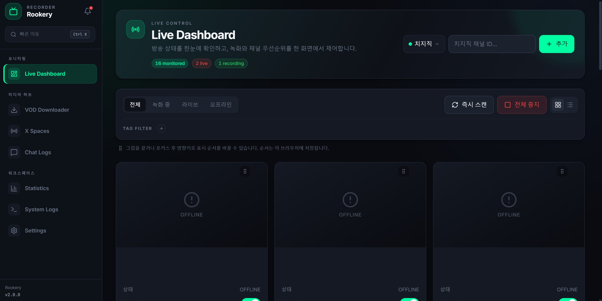
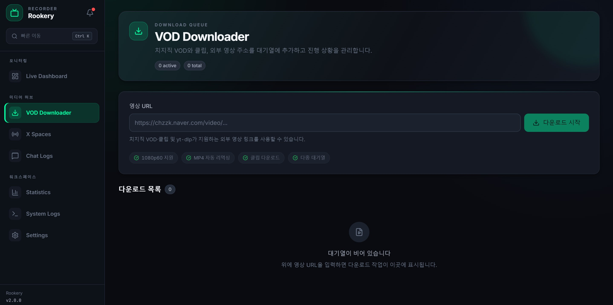
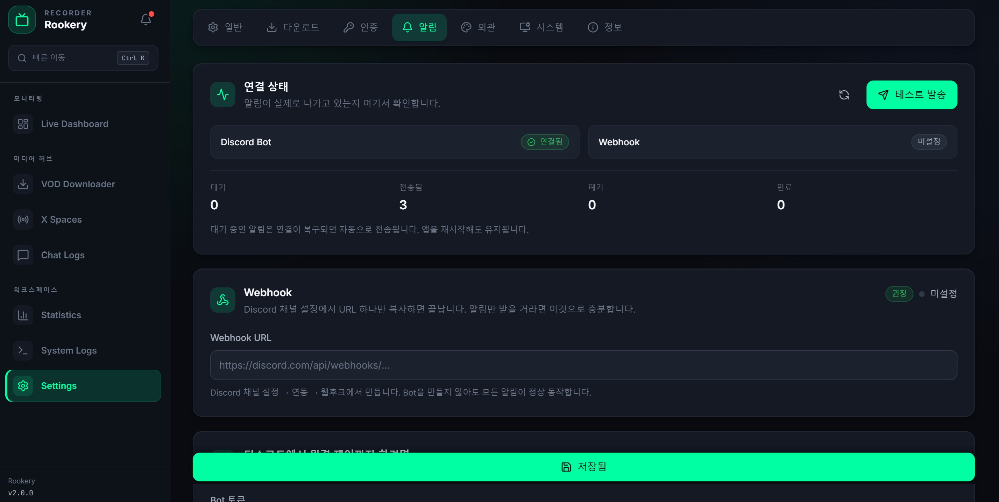

# Phrolova

Phrolova is a self-hosted web application for people who want to monitor live channels, record broadcasts, and manage media downloads on their own PC or server. It records CHZZK and YouTube video streams and X Spaces audio, with automatic recording, a download queue, and optional Discord notifications.

[Windows releases](https://github.com/ProofPage/Phrolova/releases/latest) · [Installation](#installation) · [Usage](#usage) · [Changelog](docs/CHANGELOG.md) · [Issues](https://github.com/ProofPage/Phrolova/issues)

This README describes the source reviewed on `main` at `32c2250c3acb48db676d464b582b8e8ab4e7d3fc`. At review time, the latest published release was `v2.0.48`, tagged at `e5390810e562703be337bcebdcfe77f8f3310417`; the application source and build configuration were identical, with only README changes between the two commits. The Windows executable was not run as part of this documentation review.

## Features

- Monitor CHZZK, YouTube, and X Spaces channels; enable automatic recording or start and stop recordings manually.
- Configure CHZZK automatic recording conditions for all broadcasts, watchalongs only, or broadcasts excluding watchalongs. Choose standard or time-machine streams.
- Download CHZZK VODs and clips, YouTube videos, and videos imported from YouTube channels. Pause, resume, cancel, retry, and reorder queued downloads.
- Download X Spaces audio from a Space URL or a captured playlist URL through the **X Spaces** page.
- Set separate live and download folders, video quality, output formats, filename templates, download concurrency, and download speed limits.
- Save CHZZK live chat as JSONL, search messages and nicknames, and download the original logs.
- View live video previews, recording history, statistics, disk usage, and application logs.
- Send Discord notifications through a bot or webhook; use authorized bot commands to control recordings and capture Space links.
- Use a responsive web interface with Korean, English, and Japanese language options.

### Platform coverage

| Platform | Live monitoring and recording | Existing media | Authentication |
| --- | --- | --- | --- |
| CHZZK | Video; optional chat logging and watchalong conditions | VODs and clips | Optional `NID_AUT` and `NID_SES` cookies for content requiring login |
| YouTube | Video | Individual videos and channel video imports | Optional Netscape cookie file for content requiring login |
| X Spaces | Audio; channel polling every 300 seconds | Space URLs and captured playlist URLs | X cookie file containing `auth_token` and `ct0` |

The **Downloads** page accepts CHZZK and YouTube inputs. The backend also passes other media URLs to yt-dlp through `POST /api/vod/download`, but this does not imply support for every yt-dlp site or provide channel monitoring for those sites. X Spaces has a separate input page.



<details>
<summary>Downloads and notification settings</summary>





</details>

## Requirements

- **Windows release:** the Windows x64 executable and FFmpeg. Python and Node.js are bundled; FFmpeg is not. A writable application folder and space for recordings are required.
- **Source installation:** Python 3.12, Node.js with npm, Git, and FFmpeg. Python 3.12 is the repository's development and CI baseline. Frontend CI uses Node.js 20; the Windows release workflow uses Node.js 24. Use Node.js 24 for the source setup below, which also makes it available to YouTube extraction at runtime.
- **Managed Linux/macOS installation:** Bash and curl to start the installer, permission to install dependencies, and Homebrew on macOS. The script checks for Python 3.10+, Node.js 20+, and FFmpeg 6+. These checks are not evidence of full compatibility with every accepted version; use Python 3.12 as the documented baseline.

The repository provides Windows packaging and Linux/macOS management scripts. CI coverage alone does not establish support for other operating systems or architectures.

## Installation

### Windows release

1. Download `Phrolova-v<version>-windows-x64.exe` from [Releases](https://github.com/ProofPage/Phrolova/releases/latest), replacing `<version>` with the release version.
2. Place it in a writable folder and run it.
3. If FFmpeg is missing, follow the startup console prompt to download it, or place `ffmpeg.exe` in `bin/` beside the executable or on `PATH`.
4. Complete the setup wizard in the browser. If the browser does not open, visit `http://127.0.0.1:8000`.

The Windows app can download a missing yt-dlp executable into its `bin/` folder. These downloads require network access.

To update, stop the app and replace the executable with the new release. Keep `.env`, `data/`, `bin/`, and your media folders.

### Managed Linux/macOS installation

Run the repository's installer from a terminal:

```bash
curl -fsSL https://raw.githubusercontent.com/ProofPage/Phrolova/main/scripts/manage.sh | bash
```

The script checks or installs dependencies, clones the current default branch, creates a Python virtual environment, and builds the frontend. A new installation normally uses `~/rookery`; an existing checkout or legacy installation can be reused. This installs source, not the Windows release asset.

On Linux, you can choose systemd service registration. Otherwise, start the application in the foreground:

```bash
rookery start
```

Open `http://127.0.0.1:8000` on the host, or `http://<server-address>:8000` from another device, replacing `<server-address>` with the server's address. See [Limitations](#limitations) before allowing remote access.

Use `rookery status` for status and `rookery update` to update the source installation. For a registered systemd service, `rookery stop`, `rookery restart`, and `rookery logs` manage the service. For foreground execution, stop it with **Ctrl+C** in its terminal. If `rookery` is not on `PATH`, invoke `bash scripts/manage.sh <command>` from the installed repository root, replacing `<command>` with the desired command.

The project is named Phrolova; the management command and service retain the name `rookery` in the current implementation.

### Manual source installation

With Python 3.12, Node.js 24/npm, Git, and FFmpeg installed, run the following in a Linux/macOS shell. Start in the directory where you want the checkout:

```bash
git clone https://github.com/ProofPage/Phrolova.git
cd Phrolova
python3.12 -m venv backend/.venv
backend/.venv/bin/python -m pip install -r backend/requirements.txt
cd frontend
npm ci
npm run build
cd ..
backend/.venv/bin/python backend/run.py
```

The build writes to `backend/app/static/`. The backend serves both the web interface and API at `http://127.0.0.1:8000` by default. Keep Node.js available on `PATH` for YouTube extraction. Stop the server with **Ctrl+C**.

On Windows, install the same prerequisites with Python 3.12 available as `python`, clone the repository, and run its supplied script from the repository root in Command Prompt:

```bat
scripts\manage.bat install
scripts\manage.bat start
```

Unlike `backend/run.py`, this script's `start` command explicitly binds to `127.0.0.1:8000`; it does not use `HOST` or `PORT` to select the listening address.

## Usage

1. Complete the initial setup by choosing live and video download folders, recording format, and quality. The wizard suggests `~/Downloads/Phrolova/Live` and `~/Downloads/Phrolova/Video` on the machine running the app. CHZZK cookies are optional during setup.
2. In **Settings**, adjust storage and recording options and add platform credentials if needed.
3. On **Live**, choose a platform and add a CHZZK channel ID, YouTube handle/channel ID, or X username. Enable automatic recording or use the channel's manual recording controls. CHZZK channels also expose watchalong conditions.
4. On **Downloads**, select CHZZK or YouTube and submit a matching URL. The YouTube input also accepts `@handle` for channel imports and an 11-character video ID. Channel imports enqueue discovered videos; they are not live monitoring subscriptions.
5. On **X Spaces**, submit a Space URL or a captured playlist URL. Track queued downloads on **Downloads**.
6. Use **Chat Logs** for saved CHZZK chat, **Stats** for history and storage information, and **Logs** for errors.

For a minimal first download, open **Downloads**, select **YouTube**, paste a video URL you are authorized to save, and submit it. The app queues the job and saves the result in the configured video download folder on the host, not on the device used to open the browser.

## Configuration

No environment variable is mandatory to start the app. Prefer the setup wizard and **Settings** for normal use: they save settings to `.env` and update the applicable running services. You can also edit `.env` or set process environment variables before startup; restart after manual edits. Environment variables take precedence over `.env` values.

[config.py](backend/app/core/config.py) defines the settings and defaults. [.env.example](.env.example) contains legacy entries and comments: in particular, use `LIVE_FORMAT` instead of `OUTPUT_FORMAT`, and do not assume FFmpeg is bundled or Docker installation is available from that template.

The following settings are optional; defaults apply when omitted:

| Setting | Default | Purpose |
| --- | --- | --- |
| `HOST`, `PORT` | `0.0.0.0`, `8000` | Listening address for `backend/run.py`, including the Windows executable |
| `FFMPEG_PATH` | `ffmpeg` | FFmpeg path; resolution also checks the application's `bin/` directory and system `PATH` |
| `DOWNLOAD_DIR` | `./recordings` | Fallback media folder, relative to the server's working directory |
| `LIVE_DOWNLOAD_DIR`, `VOD_DOWNLOAD_DIR` | Empty | Separate live and queued-download folders; empty values fall back to legacy folder settings, then `DOWNLOAD_DIR` |
| `MONITOR_INTERVAL` | `60` | General polling interval in seconds; X Spaces uses a separate 300-second interval |
| `LIVE_FORMAT`, `VOD_FORMAT` | `ts`, `mp4` | Video recording and download formats; the UI offers TS, MKV, and MP4. X Spaces uses audio-specific output |
| `RECORDING_QUALITY`, `VOD_DEFAULT_QUALITY` | `best`, `best` | Live video and queued-download quality defaults |
| `VOD_MAX_CONCURRENT` | `3` | Maximum simultaneous queued downloads |
| `VOD_MAX_SPEED` | `0` | Per-download yt-dlp rate limit in MB/s; `0` disables the limit |
| `CHAT_ARCHIVE_ENABLED` | `false` | Save CHZZK live chat beside its recording as JSONL |
| `SAVE_LIVE_PREVIEW` | `false` | Save a CHZZK preview image when recording starts |
| `CHZZK_STREAM_MODE` | Unset; resolves to `request-timemachine` on a new installation | `standard` uses the normal stream; `request-timemachine` tries time-machine and falls back; `force-timemachine` fails if it is unavailable. Legacy settings can override the unset default |

### Filenames

For CHZZK and YouTube live recordings, `LIVE_FILENAME_TEMPLATE` defaults to:

```text
[{name}] {title} {live_date_year}-{live_date_month}-{live_date_day} {live_date_hour}-{live_date_minute}-{live_date_second}
```

`VOD_FILENAME_TEMPLATE` defaults to:

```text
[{name}] {title} {date_year}-{date_month}-{date_day} {date_hour}-{date_minute}-{date_second}
```

These are optional and can be changed in Settings. Live date fields use the broadcast start time when available, otherwise the recording start time. Download date fields use the download start time. The application handles filename sanitization and extensions. X Spaces live recordings use a separate M4A naming scheme and do not use `LIVE_FILENAME_TEMPLATE`.

### Authentication and Discord

Configure service credentials in **Settings → Authentication** and Discord in **Settings → Notifications**. All are optional for starting the app; the corresponding service or content may require them.

| Settings | Default | Use |
| --- | --- | --- |
| `NID_AUT`, `NID_SES` | Unset | CHZZK login cookies |
| `YOUTUBE_COOKIE_FILE` | Unset | Path to a Netscape-format YouTube cookie file, also managed through the upload UI |
| `X_COOKIE_FILE` | Unset | Path to an X Netscape cookie file containing `auth_token` and `ct0`; needed for X Spaces monitoring |
| `DISCORD_BOT_TOKEN`, `DISCORD_NOTIFICATION_CHANNEL_ID` | Unset | Bot credentials and destination for bot notifications |
| `DISCORD_WEBHOOK_URL` | Unset | Webhook notifications without a bot, or fallback when bot delivery fails |
| `DISCORD_COMMAND_USER_IDS`, `DISCORD_COMMAND_CHANNEL_ID` | Unset | Allowed user IDs (comma-separated) and/or channel for bot commands |
| `DISCORD_NOTIFY_EVENTS` | `all` | Notification selection; choose events in the UI, or use `all` / `none` |

YouTube video downloads and channel imports first try without cookies, then use the configured file after a recognized authentication error. Cookies do not grant access that the account does not already have.

Discord commands enforce both user and channel restrictions when both are configured. If neither is set, the notification channel is used as the channel restriction; if none of these restrictions is configured, commands are denied.

### Stored data and backups

| Run mode | Settings | Database |
| --- | --- | --- |
| Windows executable | `.env` beside the executable | `data/rookery.db` beside the executable |
| Source or management script | `.env` at the repository root | `backend/data/rookery.db` |

Source execution falls back to an existing `backend/.env` if the root `.env` is absent. Relative media paths depend on the working directory: the Linux/macOS management script runs from `backend/`, while the manual source commands above run from the repository root. Use absolute storage paths to avoid ambiguity.

Stop the app before backing up `.env`, the data directory, and your media folders. Uploaded cookie files are stored in the data directory; separately configured cookie files must also be backed up. Keep cookies, tokens, and webhook URLs private. See [storage documentation](docs/storage.md) for the database layout.

## Building

### Frontend development

After source installation, leave the backend running and use a second terminal from the repository root:

```bash
cd frontend
npm run dev
```

Vite uses port `3000` and proxies `/api` and `/health` to `http://127.0.0.1:8000`. If you change the backend port, adjust the development proxy accordingly. Use the URL printed by Vite.

### Windows executable

On Windows, use Python 3.12 and Node.js 24/npm, matching the [release workflow](.github/workflows/release.yml). The packaging specification requires Node.js 22 or newer and downloads its license during the build. Run in PowerShell from the repository root:

```powershell
python -m pip install -r backend/requirements.txt pyinstaller pillow pystray
Set-Location frontend
npm ci
npm run build
Set-Location ..
python -m PyInstaller --clean --noconfirm rookery.spec
```

The output is `dist/Rookery.exe`. The release workflow renames it to `Phrolova-<tag>-windows-x64.exe`. [rookery.spec](rookery.spec) bundles the frontend, Python application, and Node.js runtime, but excludes FFmpeg.

The [CI workflow](.github/workflows/ci.yml) runs backend pytest, frontend TypeScript checks, and the frontend build. See [CONTRIBUTING.md](CONTRIBUTING.md) for contributor verification commands. These workflows describe configured checks, not a claim that this README review executed them.

## Limitations

- The web application has no user login or API access authentication. `backend/run.py` binds to all interfaces by default. Set `HOST=127.0.0.1` for local-only use, or restrict remote access with a firewall or authenticated reverse proxy.
- Media availability depends on upstream services, credentials, and extractors. X Spaces cookies, API rate limits, and playlist availability can affect monitoring and downloads. X Spaces has no video preview.
- CHZZK chat logging and watchalong filtering are platform-specific; they are not implemented for YouTube or X Spaces.
- The installer accepts older Python versions than the repository's Python 3.12 baseline. Compatibility with those versions is not established by its version check.

For problems, include the app version, operating system, platform, reproduction steps, and relevant logs in an [issue](https://github.com/ProofPage/Phrolova/issues). Remove credentials before sharing logs.

## Credits and License

Phrolova is distributed under the [MIT License](LICENSE), preserving the repository's copyright notice:

> Copyright (c) 2026 Serian (github.com/eruminyu)

Original author: [Serian](https://github.com/eruminyu). Current repository: [ProofPage/Phrolova](https://github.com/ProofPage/Phrolova).

FFmpeg is installed separately and is subject to its distribution's license; see [FFmpeg legal information](https://ffmpeg.org/legal.html). The Windows build collects the bundled Node.js license into `third_party/node-LICENSE.txt`.

Phrolova is not affiliated with or endorsed by CHZZK, Naver, YouTube, X, or Discord. Use it for content you have permission to save and comply with the applicable service terms and copyright requirements.
